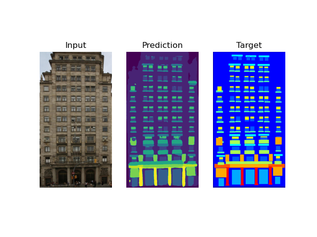

CMP dataset finetuning based on repository contains the source code of the paper:
[Wei Yin, Yifan Liu, Chunhua Shen, Anton van den Hengel, Baichuan Sun, The devil is in the labels: Semantic segmentation from sentences](https://arxiv.org/abs/2202.02002)

# Run training

```shell
/bin/bash download.sh
conda env create -f environment.yaml
conda activate ssiw
```
```python
python -m src.tools.train --max-epochs 100
```

# Test

* train your checkpoint (by default saved as out.pth)
* use my [checkpoint](https://drive.google.com/file/d/1UsAkHoSSrHX5UJwmteTi4oQWKVIPdUKn/view?usp=share_link)

```python
python -m src.tools.test_cpm data/base/base/cmp_b0346.jpg --checkpoint-path checkpoint.pth
```



# Summary

I have implemented CMP dataset loading and model training. Base repository contains only testing stage.
My train script loads the weights shared in the authors repository and fine tune it with CMP dataset.
I used only base version of dataset (extended is for testing).

Labels in the CMP dateset seems to be precise, so I have implemented only L_hd loss [equations 1, 2 and 3 in the paper](https://arxiv.org/pdf/2202.02002.pdf).
Due to the deadline I have frozen the temperature parameter in the loss.
I think that learnable parameters in the loss could slow down the development process, but it is worth to replace it with learnable parameter and check performance.

Typically large models overfit on small datasets, but in that case I have tried train only head (strong regularization) and it decreased the performance.
It is definitely worth to check more augmentations, hyperparameters and longer training time. It can be performed in next steps.

Batch size and image crop size are adapted to my VRAM resources, not the model performance.
